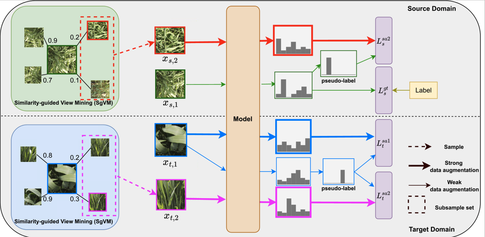

# MV-Match: Multi-View Matching for Domain-Adaptive Identification of Plant Nutrient Deficiencies


Official pytorch implementation of [MV-Match](https://arxiv.org/abs/2409.00903) (BMVC24). 

## 🚀 News
- [Jan. 08, 2025] 🔥 The [pretrained models](https://1drv.ms/f/s!AsC2VlBnTwa6keAzH05lRH1IvQQUkA?e=YMPiSt) and [datasets](https://huggingface.co/datasets/jh-yi/MiPlo) are released!
- [Nov. 26, 2024] 💥 The source code is released!

## 💡 Overview
<p align="center">

</p>

**Taks:** Unsupervised domain adaptation for classification of plant nutrient deficiencies (PND).

**Insights:** (1) Acquiring labeled data for more plants is extremely expensive, while collecting multi-view data given limited plants is straightforward; (2) Existing PND approaches do not generalize to unseen genotypes / cultivars.

**MV-Match:** We propose a framework that leverages multiple camera views in the source and target domain for unsupervised domain adaptation for PND.

**Datasets:** We show that our MV-Match achieves state-of-the-art results on two proposed nutrient deficiency datasets: MiPlo-B and MiPlo-WW.


## Getting Started

### 🔧 Installation
**1. Prepare the code and the environment**
```bash
git clone https://github.com/jh-yi/MV-Match
conda create -n mv_match python=3.8.16 -y
conda activate mv_match

pip install torch==1.13.1 torchvision==0.14.1
pip install opencv-python portalocker tqdm webcolors scikit-learn matplotlib numba timm numpy==1.23.5 tensorboardX prettytable timm wandb scikit-image line_profiler seaborn pandas
pip install -i https://test.pypi.org/simple/ tllib==0.4
export PYTHONPATH=$PYTHONPATH:.
```

**2. Prepare the pretrained models**

Please download the pretrained models from [OneDrive](https://1drv.ms/f/s!AsC2VlBnTwa6keAzH05lRH1IvQQUkA?e=YMPiSt). 

After downloading, organize the data as follows:
```
MV-Match
├── logs
│   └── mv-match
│       ├── MiPlo_B2H_hard_69.6/checkpoints/best.pth
│       └── ...
└── ...
```

**3. Prepare the datasets**

Please download the **MiPlo** datasets from [Huggingface](https://huggingface.co/datasets/jh-yi/MiPlo):
```bash
# Make sure you have git-lfs installed (https://git-lfs.com)
git lfs install
git clone https://huggingface.co/datasets/jh-yi/MiPlo
```

Note: We provide the raw images with resolution of 7296x5472 (5472x7296). The first epoch of training (and validation) might be slow due to loading high-resolution images. For acceleration, we also provide the resized images as pickle files with resolution of 1344x1344 & 224x224 (this is optional, if you don't download the cache dir, the raw images will be loaded, resized, and saved as pickle files in the first epoch as well).

After downloading, extract the files with:
```bash
cat images.tar.gz.* > images.tar.gz
tar -zxvf images.tar.gz
cat cache.tar.gz.* > cache.tar.gz
tar -zxvf cache.tar.gz
```
and organize the data as follows:
```
MiPlo
├── images
│   ├── MiPlo-B
│   │   ├── xxx.jpg
│   │   └── ...
│   └── MiPlo-WW
└── cache (optional)
    ├── 224
    │   ├── MiPlo-B
    │   │   ├── xxx.pkl
    │   │   └── ...
    │   └── MiPlo-WW   
    └── 1344
        ├── MiPlo-B
        └── MiPlo-WW  
```

### 🗝️ Train and Evaluation
**Training:** Specify your `DATA_ROOT` in [train.sh](scripts/train.sh). You can train and evaluate the model with:
```bash
CUDA_VISIBLE_DEVICES=0 bash scripts/train.sh # train & evaluate
```
**Evaluation:** Specify your `DATA_ROOT` and `LOG_DIR` in [test.sh](scripts/test.sh). You can evaluate the model with:
```bash
CUDA_VISIBLE_DEVICES=0 bash scripts/test.sh # evaluate only
```

## ❤️ Acknowledgments

Our code is adapted from [Transfer-Learning-library](https://github.com/thuml/Transfer-Learning-Library/tree/master). Thanks for their wonderful works and code!

## ✏️ Citation

If MV-Match is helpful for your research, please consider giving a star ⭐ and citation 📝.
```
@inproceedings{yi2024mvmatch,
    title={MV-Match: Multi-View Matching for Domain-Adaptive Identification of Plant Nutrient Deficiencies},
    author={Yi, Jinhui and Luo, Yanan and Deichmann, Marion and Schaaf, Gabriel and Gall, Juergen},
    booktitle={BMVC},
    year={2024}
}
```
## 🔒 License

- The content of this project is released under the MIT license license as found in the [LICENSE](https://github.com/jh-yi/MV-Match/blob/main/LICENSE) file.
- This dataset follows Creative Commons Attribution Non Commercial Share Alike 4.0 Internation License.
